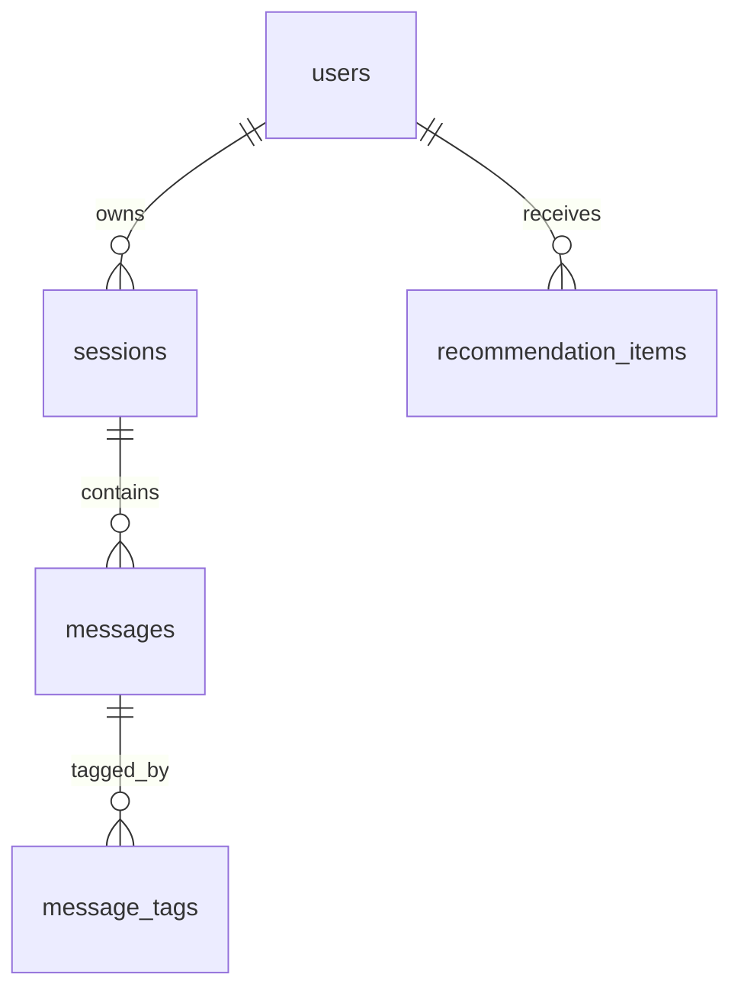

# 数据库设计初稿

## 1. 文档目标

本文基于 `.project/系统模块设计方案.md` 输出第一版数据库设计草案，目标是为后续 API 设计、后端实现和前端接入提供统一的数据基础。

本稿只覆盖当前任务范围内的数据库结构设计，不包含：

- 后端业务代码
- 前端页面
- 接口联调
- 流式输出设计
- 推荐模块算法细节

## 2. 设计原则

### 2.1 目标数据库

- 目标数据库：SQLite
- 时间字段统一使用 `TEXT`，默认值采用 `CURRENT_TIMESTAMP`
- 关系约束依赖 SQLite 外键能力，应用启动时需要显式执行 `PRAGMA foreign_keys = ON`

### 2.2 主键策略

本稿统一使用 `INTEGER PRIMARY KEY` 作为主键方案，不使用 UUID。

选择理由：

- SQLite 对整数主键支持最好，天然映射 `rowid`，实现简单
- 当前项目是单机单库、演示优先场景，不存在分布式写入带来的 UUID 必要性
- 整数主键更适合后续 API、调试日志和前后端联调时快速定位记录

### 2.3 时间与排序策略

- `created_at` 表示记录首次创建时间
- `sessions.updated_at` 用于会话列表按最近活跃时间排序
- `messages` 额外增加 `sequence_no`，避免仅靠秒级时间戳导致消息顺序不稳定

### 2.4 约束策略

- 用户名唯一：`users.username`
- 消息角色使用 `CHECK` 约束，限制在 `system`、`user`、`assistant`、`tool`
- `messages.tools_used` 采用 JSON 字符串存储，当前阶段不拆独立工具调用表
- 删除父记录时级联删除子记录，避免留下孤儿数据

## 3. 阶段划分

| 表名 | 阶段归属 | 本轮要求 | 说明 |
|------|----------|----------|------|
| `users` | 第一阶段必需 | 本轮必须定义 | 支撑后续登录、注册、用户画像 |
| `sessions` | 第一阶段必需 | 本轮必须定义 | 支撑历史会话列表与会话切换 |
| `messages` | 第一阶段必需 | 本轮必须定义 | 支撑聊天消息存储与历史回放 |
| `message_tags` | 后续阶段预留 | 本轮只定义结构 | 支撑学习分析与薄弱点统计 |
| `recommendation_items` | 后续阶段预留 | 本轮只定义结构 | 支撑推荐题目落库与“完成/跳过”反馈 |

说明：

- 虽然项目决策中“登录注册后置”，但本轮仍需先把 `users` 结构定下来，保证后续 API 设计有稳定基础
- 后续阶段预留表本轮不要求实现业务逻辑，只要求把结构和关系定义清楚

## 4. 核心关系图



## 5. 表设计明细

### 5.1 `users`（第一阶段必需）

用途：保存平台用户基础信息，为后续登录、用户画像和数据归属提供根节点。

| 字段名 | 类型 | 约束 | 说明 |
|--------|------|------|------|
| `id` | INTEGER | PRIMARY KEY | 用户主键 |
| `username` | TEXT | NOT NULL, UNIQUE | 登录用户名，平台内唯一 |
| `password_hash` | TEXT | NOT NULL | 密码哈希值，不存明文密码 |
| `grade` | TEXT | NOT NULL | 年级，如“高一”“大二” |
| `subject` | TEXT | NOT NULL | 主修或当前辅导学科 |
| `created_at` | TEXT | NOT NULL, DEFAULT CURRENT_TIMESTAMP | 创建时间 |

补充说明：

- 当前不单独设计用户资料扩展表，先保证注册与用户识别最小闭环
- `grade` 和 `subject` 保持 `TEXT`，避免过早枚举化导致前期变更成本升高

### 5.2 `sessions`（第一阶段必需）

用途：保存每个用户的对话会话元信息，支撑“历史会话列表”和“切换会话”能力。

| 字段名 | 类型 | 约束 | 说明 |
|--------|------|------|------|
| `id` | INTEGER | PRIMARY KEY | 会话主键 |
| `user_id` | INTEGER | NOT NULL, REFERENCES `users(id)` ON DELETE CASCADE | 所属用户 |
| `title` | TEXT | NOT NULL, DEFAULT '新会话' | 会话标题，可由首轮问题或摘要生成 |
| `created_at` | TEXT | NOT NULL, DEFAULT CURRENT_TIMESTAMP | 会话创建时间 |
| `updated_at` | TEXT | NOT NULL, DEFAULT CURRENT_TIMESTAMP | 最近活跃时间，用于会话列表排序 |

补充说明：

- 新会话创建时可先使用默认标题，后续由服务端在首轮对话后更新为更可读的标题
- `updated_at` 需要在每次写入新消息时同步更新

### 5.3 `messages`（第一阶段必需）

用途：按消息粒度保存一次会话中的完整对话内容，支撑聊天回放、历史记录和后续学习分析。

| 字段名 | 类型 | 约束 | 说明 |
|--------|------|------|------|
| `id` | INTEGER | PRIMARY KEY | 消息主键 |
| `session_id` | INTEGER | NOT NULL, REFERENCES `sessions(id)` ON DELETE CASCADE | 所属会话 |
| `sequence_no` | INTEGER | NOT NULL | 会话内消息顺序，从 1 开始递增 |
| `role` | TEXT | NOT NULL, CHECK (`role` IN ('system', 'user', 'assistant', 'tool')) | 消息角色 |
| `content` | TEXT | NOT NULL | 消息正文 |
| `tools_used` | TEXT | NULL | 工具调用摘要，JSON 字符串 |
| `created_at` | TEXT | NOT NULL, DEFAULT CURRENT_TIMESTAMP | 消息创建时间 |

补充说明：

- `UNIQUE(session_id, sequence_no)` 用于保证同一会话内顺序唯一
- `role` 预留 `system` 和 `tool`，虽然第一阶段主要使用 `user`、`assistant`，但这样可以兼容后续完整 Agent 轨迹
- `tools_used` 当前使用 JSON 字符串，例如：

```json
[
  {
    "tool_name": "calculator_tool",
    "status": "success"
  }
]
```

为什么本轮不拆工具调用表：

- 当前验收目标是完成数据库基础设计，而不是做工具调用分析系统
- 一条助手消息可能触发 0 到多次工具调用，先存 JSON 更贴合 MVP 实现成本
- 如果后续需要做工具统计、审计和耗时分析，再拆 `message_tool_calls` 更合适

### 5.4 `message_tags`（后续阶段预留）

用途：为消息打知识点标签，支撑学习记录页中的标签统计和薄弱点分析。

| 字段名 | 类型 | 约束 | 说明 |
|--------|------|------|------|
| `id` | INTEGER | PRIMARY KEY | 标签记录主键 |
| `message_id` | INTEGER | NOT NULL, REFERENCES `messages(id)` ON DELETE CASCADE | 被标注的消息 |
| `tag` | TEXT | NOT NULL | 知识点标签 |
| `created_at` | TEXT | NOT NULL, DEFAULT CURRENT_TIMESTAMP | 标注时间 |

补充说明：

- 建议增加 `UNIQUE(message_id, tag)`，避免同一消息重复写入同一个标签
- 当前设计默认主要给学生提问消息打标签；如果后续要按整轮对话或 AI 回答打标签，可继续沿用本表

### 5.5 `recommendation_items`（后续阶段预留）

用途：以“一题一行”的方式保存推荐题目及其反馈状态，支撑推荐页和“完成/跳过”功能。

| 字段名 | 类型 | 约束 | 说明 |
|--------|------|------|------|
| `id` | INTEGER | PRIMARY KEY | 推荐题目主键 |
| `user_id` | INTEGER | NOT NULL, REFERENCES `users(id)` ON DELETE CASCADE | 被推荐给哪个用户 |
| `recommended_topic` | TEXT | NOT NULL | 推荐依据的薄弱知识点 |
| `question_payload` | TEXT | NOT NULL | 题目内容，JSON 字符串 |
| `source` | TEXT | NOT NULL, DEFAULT 'question_tool' | 推荐来源 |
| `status` | TEXT | NOT NULL, DEFAULT 'pending', CHECK (`status` IN ('pending', 'completed', 'skipped')) | 推荐处理状态 |
| `created_at` | TEXT | NOT NULL, DEFAULT CURRENT_TIMESTAMP | 题目生成时间 |
| `feedback_at` | TEXT | NULL | 用户完成或跳过的时间 |

补充说明：

- 这里不再单独拆“推荐表 + 反馈表”，因为当前阶段重点是保证推荐接口能返回题目并记录处理状态
- `question_payload` 可保存题干、选项、答案、解析等结构，例如：

```json
{
  "question": "已知函数 f(x)=x^2，求 f(2)",
  "options": ["1", "2", "4", "8"],
  "answer": "4",
  "analysis": "代入 x=2，得到 2^2=4"
}
```

## 6. 关系与约束汇总

| 子表 | 外键字段 | 父表 | 删除策略 | 说明 |
|------|----------|------|----------|------|
| `sessions` | `user_id` | `users` | ON DELETE CASCADE | 删除用户时同步删除其会话 |
| `messages` | `session_id` | `sessions` | ON DELETE CASCADE | 删除会话时同步删除消息 |
| `message_tags` | `message_id` | `messages` | ON DELETE CASCADE | 删除消息时同步删除标签 |
| `recommendation_items` | `user_id` | `users` | ON DELETE CASCADE | 删除用户时同步删除推荐记录 |

## 7. 索引建议

| 索引名 | 表 | 字段 | 目的 |
|--------|----|------|------|
| `idx_sessions_user_updated_at` | `sessions` | (`user_id`, `updated_at` DESC) | 快速查询某用户最近会话 |
| `idx_messages_session_sequence` | `messages` | (`session_id`, `sequence_no`) | 快速按顺序读取会话消息 |
| `idx_message_tags_tag` | `message_tags` | (`tag`) | 支撑知识点频率统计 |
| `idx_recommendation_items_user_created_at` | `recommendation_items` | (`user_id`, `created_at` DESC) | 查询用户推荐历史 |

## 8. SQLite DDL 草案

```sql
CREATE TABLE users (
    id INTEGER PRIMARY KEY,
    username TEXT NOT NULL UNIQUE,
    password_hash TEXT NOT NULL,
    grade TEXT NOT NULL,
    subject TEXT NOT NULL,
    created_at TEXT NOT NULL DEFAULT CURRENT_TIMESTAMP
);

CREATE TABLE sessions (
    id INTEGER PRIMARY KEY,
    user_id INTEGER NOT NULL,
    title TEXT NOT NULL DEFAULT '新会话',
    created_at TEXT NOT NULL DEFAULT CURRENT_TIMESTAMP,
    updated_at TEXT NOT NULL DEFAULT CURRENT_TIMESTAMP,
    FOREIGN KEY (user_id) REFERENCES users(id) ON DELETE CASCADE
);

CREATE TABLE messages (
    id INTEGER PRIMARY KEY,
    session_id INTEGER NOT NULL,
    sequence_no INTEGER NOT NULL,
    role TEXT NOT NULL CHECK (role IN ('system', 'user', 'assistant', 'tool')),
    content TEXT NOT NULL,
    tools_used TEXT NULL,
    created_at TEXT NOT NULL DEFAULT CURRENT_TIMESTAMP,
    UNIQUE (session_id, sequence_no),
    FOREIGN KEY (session_id) REFERENCES sessions(id) ON DELETE CASCADE
);

CREATE TABLE message_tags (
    id INTEGER PRIMARY KEY,
    message_id INTEGER NOT NULL,
    tag TEXT NOT NULL,
    created_at TEXT NOT NULL DEFAULT CURRENT_TIMESTAMP,
    UNIQUE (message_id, tag),
    FOREIGN KEY (message_id) REFERENCES messages(id) ON DELETE CASCADE
);

CREATE TABLE recommendation_items (
    id INTEGER PRIMARY KEY,
    user_id INTEGER NOT NULL,
    recommended_topic TEXT NOT NULL,
    question_payload TEXT NOT NULL,
    source TEXT NOT NULL DEFAULT 'question_tool',
    status TEXT NOT NULL DEFAULT 'pending'
        CHECK (status IN ('pending', 'completed', 'skipped')),
    created_at TEXT NOT NULL DEFAULT CURRENT_TIMESTAMP,
    feedback_at TEXT NULL,
    FOREIGN KEY (user_id) REFERENCES users(id) ON DELETE CASCADE
);

CREATE INDEX idx_sessions_user_updated_at
    ON sessions(user_id, updated_at DESC);

CREATE INDEX idx_messages_session_sequence
    ON messages(session_id, sequence_no);

CREATE INDEX idx_message_tags_tag
    ON message_tags(tag);

CREATE INDEX idx_recommendation_items_user_created_at
    ON recommendation_items(user_id, created_at DESC);
```

## 9. 对后续 API 设计的直接影响

### 9.1 用户接口

- `POST /api/register` 需要写入 `users`
- `POST /api/login` 需要按 `username` 查 `users`
- 当前不额外设计 JWT 持久化表，默认采用无状态 JWT

### 9.2 对话接口

- `POST /api/chat` 需要创建或复用 `sessions`，并写入 `messages`
- `GET /api/sessions` 主要查询 `sessions`
- `GET /api/sessions/{id}` 需要基于 `session_id + sequence_no` 返回完整消息流

### 9.3 学习分析接口

- `GET /api/analytics/tags` 基于 `message_tags` 聚合统计
- `GET /api/analytics/report` 可在 `message_tags` 基础上取 Top3 知识点

### 9.4 推荐接口

- `GET /api/recommend` 可按用户薄弱点生成题目并写入 `recommendation_items`
- `POST /api/recommend/feedback` 可更新 `recommendation_items.status` 和 `feedback_at`

## 10. 本稿结论

本稿已经满足当前任务对数据库设计初稿的要求：

- 已定义 `users`、`sessions`、`messages` 三张核心表
- 已明确主键、主要字段、外键关系和索引建议
- 已区分第一阶段必需表与后续阶段预留表
- 结构可直接支撑后续聊天、登录、历史记录、学习分析和推荐反馈的 API 设计
